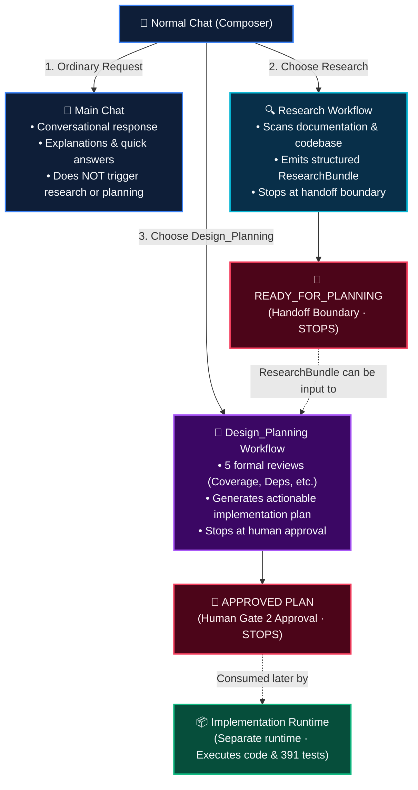
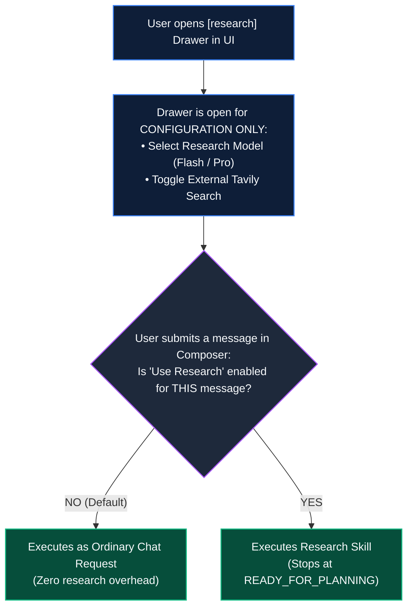
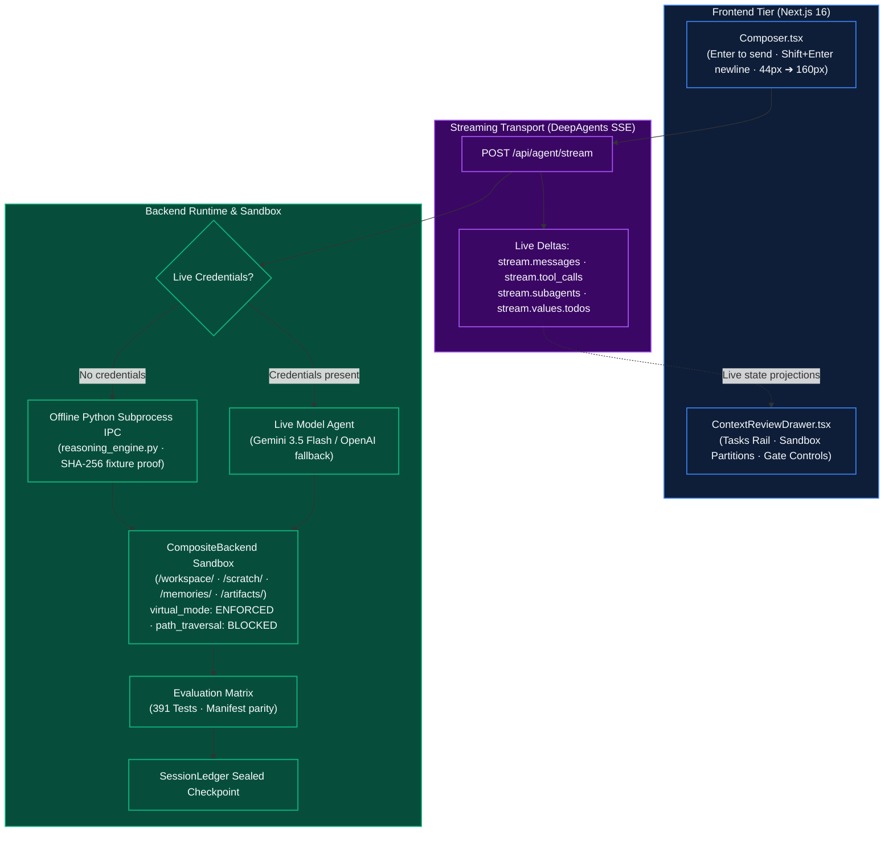

# OneShot — Architecture & Workflow DAGs

This document defines the core architecture, state machines, and dependencies of OneShot as established in `ARCHITECTURE.md`.

---

## 1. The 3 Distinct Pathways from Normal Chat

OneShot is **not** an automatic conveyor belt. From Normal Chat, the user deliberately chooses between three distinct, isolated pathways:

---

## 2. Three Distinct Owners, Boundary Dependencies & Prerequisite Contracts

Each owner requires explicit input dependencies and stops at its boundary. The `ImplementationRuntime` is legally constructed **only** when an `ApprovedPlan` is provided:

```mermaid
flowchart TD
    %% ─────────────────────────────────────────────────────────────
    %% OWNER 1: RESEARCH
    %% ─────────────────────────────────────────────────────────────
    subgraph O1["Owner 1: Research Skill"]
        subgraph O1_DEPS["Research Input Dependencies"]
            D_PROMPT["User Intent / Prompt"]
            D_MODEL["Researcher Model Config (Flash / Pro)"]
            D_SEARCH["SearchConfig (Tavily external search / none)"]
        end
        O1_DEPS --> R_RUN["7-Phase Research Workflow\n(ACTIVE ➔ RECONCILING ➔ RESEARCHING ➔ DRAFTING\n➔ BASELINE_VALIDATING ➔ REVIEW)"]
        R_RUN --> R_BUNDLE[/"Output: ResearchBundle (audit_id)\n• Sources · Gaps · Alternatives\n• Decision owner: Design_Planning"/]
        R_BUNDLE --> R_STOP(["🛑 STOP · READY_FOR_PLANNING\n(Handoff Boundary)"])
    end

    %% ─────────────────────────────────────────────────────────────
    %% BOUNDARY 1: GATE 1
    %% ─────────────────────────────────────────────────────────────
    R_STOP --> GATE1{"🚪 Boundary 1: Human Gate 1\nHuman verifies research findings"}

    %% ─────────────────────────────────────────────────────────────
    %% OWNER 2: DESIGN_PLANNING
    %% ─────────────────────────────────────────────────────────────
    subgraph O2["Owner 2: Design_Planning Skill"]
        subgraph O2_INPUTS["PlannerInput Contract Dependencies"]
            IN_INTENT["userIntent: string"]
            IN_REPO["repositoryState: string"]
            IN_ARCH["existingArchitecture: string"]
            IN_RECEIPTS["existingPhaseReceipts & existingBaselines"]
            IN_BUNDLE["researchBundle?: ResearchBundle (from Gate 1)"]
        end
        
        O2_INPUTS --> P_AUDIT["Planner 5 Systematic Reviews:\n1. Coverage Review\n2. Dependency Review (packages, modules & tree)\n3. Structure Review\n4. Fixture Review\n5. Goal Review"]
        
        P_AUDIT --> P_PLAN[/"Output: ApprovedPlan Artifact\n• planId: string\n• steps: string[]\n• reviews: PlannerReview[]\n• auditId?: string"/]
        
        P_PLAN --> P_STOP(["🛑 STOP · PRE_BUILD_REVIEWED\n(Run Ends Without Implementation Theater)"])
    end

    GATE1 -->|"Explicit User Action\n(canInvokeDesignPlanning)"| O2_INPUTS

    %% ─────────────────────────────────────────────────────────────
    %% BOUNDARY 2: GATE 2
    %% ─────────────────────────────────────────────────────────────
    P_STOP --> GATE2{"🚪 Boundary 2: Human Gate 2\nUser inspects plan diffs & approves"}

    %% ─────────────────────────────────────────────────────────────
    %% OWNER 3: IMPLEMENTATION RUNTIME
    %% ─────────────────────────────────────────────────────────────
    subgraph O3["Owner 3: Implementation Runtime"]
        subgraph O3_DEPS["ImplementationRuntime Construction Dependencies"]
            DEP_PLAN["ApprovedPlan (strictly required)\n• Throws error if missing or without planId"]
            DEP_SANDBOX["CompositeBackend 4 Partitions:\n• /workspace/ (Physical disk durable code)\n• /scratch/ (Thread RAM) · /memories/ (Cross-thread)\n• /artifacts/ (Frozen hash packages)"]
            DEP_REASONER["Offline Python Reasoner & Subprocess IPC\n(reasoning_engine.py · SHA-256 fixture proofs)"]
            DEP_TESTS["Test Suite & Verification Matrix\n(391 Node/TS tests + manifest verification)"]
        end

        O3_DEPS --> EXEC_CHAIN["Strict 7-Phase Execution Lifecycle (One phase at a time):\nIMPLEMENTATION ➔ GAP_DISCOVERY ➔ GAP_RESOLUTION\n➔ VERIFICATION ➔ RECEIPT ➔ PROMOTION ➔ CLOSED"]
        
        EXEC_CHAIN --> EXEC_RECEIPT(["🏁 Sealed Run Receipt\n(Evidence-backed proof: Expected == Observed)"])
    end

    GATE2 -->|"User Click 'Approve Plan & Build'\n(new ImplementationRuntime(approvedPlan))"| O3_DEPS

    %% ─────────────────────────────────────────────────────────────
    %% STYLING
    %% ─────────────────────────────────────────────────────────────
    classDef o1 fill:#082f49,stroke:#06b6d4,stroke-width:1.5px,color:#f8fafc;
    classDef o2 fill:#3b0764,stroke:#a855f7,stroke-width:1.5px,color:#f8fafc;
    classDef o3 fill:#064e3b,stroke:#10b981,stroke-width:1.5px,color:#f8fafc;
    classDef gate fill:#451a03,stroke:#f59e0b,stroke-width:2px,color:#fef3c7;
    classDef stop fill:#4c0519,stroke:#f43f5e,stroke-width:2px,color:#fff1f2;
    classDef dep fill:#0f172a,stroke:#3b82f6,stroke-width:1px,color:#94a3b8;

    class O1,R_RUN o1;
    class O2,P_AUDIT o2;
    class O3,EXEC_CHAIN o3;
    class GATE1,GATE2 gate;
    class R_STOP,P_STOP stop;
    class O1_DEPS,O2_INPUTS,O3_DEPS dep;
```

---

## 3. The `[research]` Drawer Is Configuration, NOT "Start Now"

Opening the research drawer in the UI does **not** trigger a run:

---

## 4. End-to-End Orchestration with Real-Time SSE Streams

