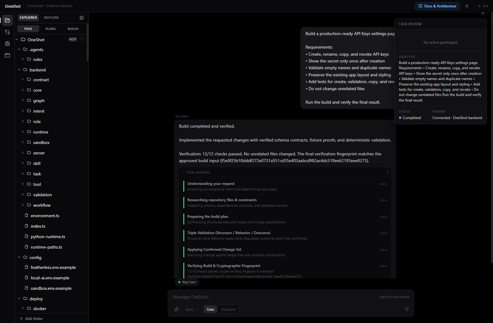
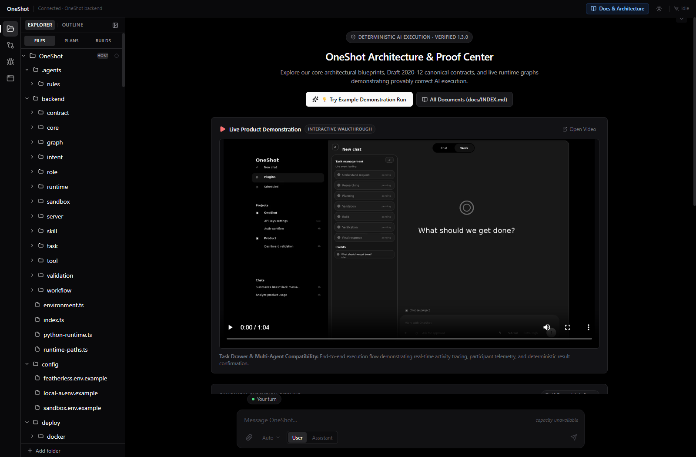
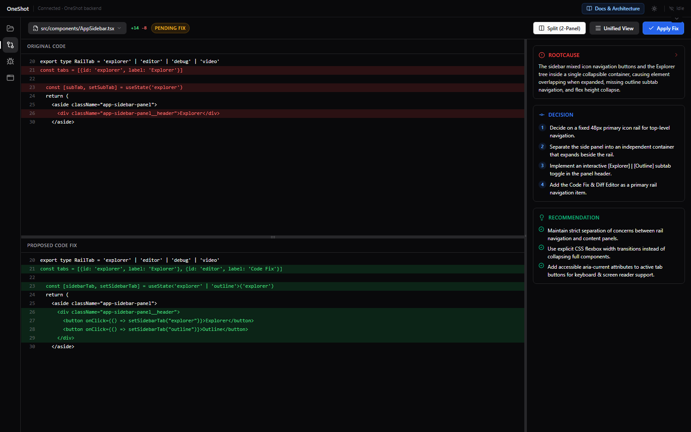
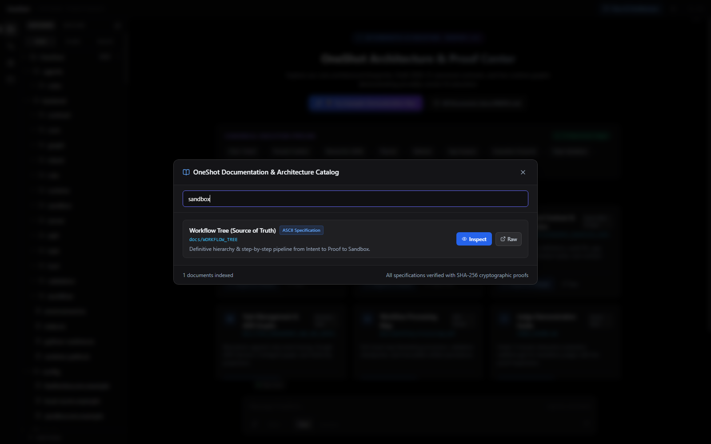

# 🎯 OneShot Judge Demonstration & Review Guide

> **Quick Start:** Clone → Setup → Launch OneShot in under 3 minutes with full instant video playback and interactive IDE review.

---

<details open>
<summary><b>📑 Table of Contents (Click to Expand / Collapse Navigation)</b></summary>

- [Instant Video Demonstration](#instant-video-demonstration)
- [Modern Product Interface Overview](#modern-product-interface-overview)
- [Backend Configuration & Settings (Human-Readable Guide)](#backend-configuration--settings-human-readable-guide)
- [1. What Is OneShot?](#1-what-is-oneshot)
  - [Architecture & Verification Documentation Index](#architecture--verification-documentation-index)
- [2. 60-Second Setup](#2-60-second-setup)
  - [Prerequisites & Automated Bootstrap](#prerequisites--automated-bootstrap)
- [3. Run the OneShot Demonstration](#3-run-the-oneshot-demonstration)
  - [Real Execution Pipeline](#real-execution-pipeline)
  - [Interactive Demonstration Steps](#interactive-demonstration-steps)
- [4. Demonstration Modes](#4-demonstration-modes)
  - [Mode A: Deterministic Sample Provider (Default)](#mode-a-deterministic-sample-provider-default)
  - [Mode B: Production AI Provider (Featherless Gemma 4)](#mode-b-production-ai-provider-featherless-gemma-4)
- [5. Verification & Test Suite](#5-verification--test-suite)
  - [Verification Matrix (203 Automated Tests)](#verification-matrix-203-automated-tests)
- [6. Key Technical Highlights for Scoring](#6-key-technical-highlights-for-scoring)
- [7. Troubleshooting & FAQ](#7-troubleshooting--faq)
- [8. Container Deployment (Docker)](#8-container-deployment-docker)

</details>

---

## Instant Video Demonstration

Watch the complete, end-to-end OneShot demonstration video below (also embedded natively in the OneShot IDE Welcome Hub):

<video src="docs/OneShot_Task_Drawer_Compatibility_Fixed.mp4" controls autoplay loop muted playsinline preload="auto" width="100%" poster="docs/screenshots/live_oneshot_welcome_with_video.png">
  <source src="docs/OneShot_Task_Drawer_Compatibility_Fixed.mp4" type="video/mp4">
  Your browser does not support the video tag. <a href="docs/OneShot_Task_Drawer_Compatibility_Fixed.mp4">Click here to download and view the demonstration video</a>.
</video>

### Instant Video Playback Options

| Method | Command / Action | Description |
| --- | --- | --- |
| **Web IDE Native Player** | `npm run oneshot` | Boots server and opens browser with embedded autoplay video in Welcome Hub |
| **Node.js Quick Player** | `npm run view:video` | Instantly launches the video in your system's default media player |
| **Python Quick Player** | `python scripts/view_video.py` | Standalone Python script to open and play the MP4 |
| **Direct File Link** | [`docs/OneShot_Task_Drawer_Compatibility_Fixed.mp4`](docs/OneShot_Task_Drawer_Compatibility_Fixed.mp4) | Direct local file access |

---

## Modern Product Interface Overview

| Continuous Conversational Session & Task Drawer | Welcome Hub with Embedded Video Walkthrough |
| --- | --- |
|  |  |

| Interactive Code Fix & Diff Editor | Schema & Architecture Documentation Hub |
| --- | --- |
|  |  |

---

## Backend Configuration & Settings (Human-Readable Guide)

All OneShot backend behaviors are governed by strict, deterministic configuration settings. Below is the complete human-readable reference mapping backend variables to their front-view IDE representation:

| Setting / Variable | Front-View IDE Display | Default Value | Supported Values | Human-Readable Description |
| --- | --- | --- | --- | --- |
| `ONESHOT_MODE` | Header Mode Badge (`SAMPLE` / `PRODUCTION`) | `sample` | `sample`, `production` | Switches between offline deterministic fixture execution and live AI provider execution. |
| `ONESHOT_RESEARCH_PROVIDER` | Top Bar & Status Bar Provider Name | `FixtureResearchProvider` | `sample`, `adk_gemma2`, `featherless` | Defines the active research provider engine (Mock Fixture, Google ADK Gemma 2 9B, or Featherless Gemma 4 31B). |
| `PORT` | Local Server URL | `8787` | Port number (`8000`-`65535`) | HTTP/SSE server listening port for both the React IDE and API endpoints. |
| `ONESHOT_BIND_HOST` | Network Access Badge | `127.0.0.1` | `127.0.0.1`, `0.0.0.0` | Server host binding. Loopback by default; non-loopback requires operator token. |
| `ONESHOT_API_TOKEN` | Auth Wall / Login Dialog | *(empty)* | String secret | When set, enables session cookie authentication, CSRF synchronizer tokens, and Bearer token gates. |
| `ONESHOT_SANDBOX_TIMEOUT_MS` | Sandbox Execution Telemetry | `30000` (30s) | Milliseconds | Hard execution deadline for container/hardened process isolation runners. |
| `ONESHOT_SANDBOX_MAX_BYTES` | Resource Quota Indicator | `10485760` (10MB) | Bytes | Upper bound on sandbox workspace output before triggering deterministic resource exhaustion abort. |
| `FEATHERLESS_API_KEY` | Provider Auth Status | *(empty)* | API Key | Remote authentication bearer for production Featherless Gemma 4 inference. |

---

## 1. What Is OneShot?

**OneShot** is an enterprise-grade deterministic AI execution platform that transforms natural language intent into a provably correct, cryptographically hash-verified execution plan.

### Architecture & Verification Documentation Index

<details>
<summary><b>Click to expand documentation catalog</b></summary>

| Document | Format | Description |
| --- | --- | --- |
| [`docs/INDEX.md`](docs/INDEX.md) | Markdown | **Master Documentation Index**: Complete hub for all specifications and guides. |
| [`docs/WORKFLOW_TREE`](docs/WORKFLOW_TREE) | ASCII Tree | **Source of Truth Execution Hierarchy**: Immutable sequence from Intent → Triple Validation → Hash → Sandbox. |
| [`docs/WORKFLOW_TREE.pdf`](docs/WORKFLOW_TREE.pdf) | PDF Diagram | **Visual Workflow Architecture**: Visual diagram of canonical stages and validation gates. |
| [`docs/source/OneShot_Canonical_Contract_and_Verification.txt`](docs/source/OneShot_Canonical_Contract_and_Verification.txt) | Draft 2020-12 Spec | **Canonical Contracts & Verification**: Schemas, audit IDs, triple validation, and hash proof definitions. |
| [`docs/TASK_MANAGEMENT_AND_ADK_GRAPH.md`](docs/TASK_MANAGEMENT_AND_ADK_GRAPH.md) | Runtime Spec | **Task Management & ADK Graphs**: Monotonic append-only events, Google ADK Gemma 2 and Authority graphs. |
| [`docs/Workflow_Processing.pdf`](docs/Workflow_Processing.pdf) | PDF Map | **Workflow Processing Map**: Full end-to-end visual state machine diagram. |
| [`CANONICAL_WORKFLOW.md`](CANONICAL_WORKFLOW.md) | Workflow Spec | **Canonical Workflow Order**: Role separation (`ROLE != SKILL != TOOL != WORKFLOW`) and proof requirements. |

</details>

---

## 2. 60-Second Setup

### Prerequisites & Automated Bootstrap

- **Node.js 20+** — [nodejs.org](https://nodejs.org)
- **Python 3.11+** — [python.org](https://www.python.org)

```bash
git clone https://github.com/itz1508/oneshot_e2e.git
cd oneshot_e2e
npm run oneshot
```

<details open>
<summary><b>What <code>npm run oneshot</code> automates (click to collapse)</b></summary>

- ✅ Verifies Node.js (≥20) and Python (≥3.11)
- ✅ Creates `.venv` when it is missing and verifies pinned Python profiles
- ✅ Installs root and `web/` Node dependencies from their vendored offline lockfiles
- ✅ Builds the TypeScript backend and OneShot React IDE
- ✅ Verifies canonical contracts and `MANIFEST.sha256`
- ✅ Runs the entire 98-test verification suite (49 Python + 49 TypeScript)
- ✅ Starts the runtime, waits for `/api/health`, and opens `http://localhost:8787` in your browser

</details>

---

## 3. Run the OneShot Demonstration

```bash
npm run oneshot
```

### Real Execution Pipeline

<details>
<summary><b>Click to expand real execution graph</b></summary>

```text
IDE Chat
 └── Conversation API (/api/conversations)
      └── Intent Engine (intent:id revision)
           └── Prompt Creation (prompt:id)
                └── Researcher (selected ResearchProvider)
                     └── Planner (audit:id)
                          └── Refactor (preserves plan:id)
                               └── Gap Analysis (gap_0: true)
                                    └── Evaluation (9-point matrix)
                                         ├── Schema Validation ──┐
                                         ├── Fixture Validation ──┼─ Triple Validation
                                         └── Goal Validation ────┘      │
                                                                        v
                                                                   all VALID
                                                                        │
                                                                        v
                                                                    CONFIRMED
                                                                        │
                                                                        v
                                                                   CREATE HASH
                                                                        │
                                                                        v
                                                                      HASH
                                                                        │
                                                                        v
                                                                      DONE
```

</details>

### Interactive Demonstration Steps

1. In the **OneShot IDE**, click **"💡 Try Example Demonstration Run"** on the Welcome Hub (or type any custom request in Chat).
2. Click **Send** — this initiates the real Chat → Intent → Prompt flow.
3. Watch the **13 visible workflow processors** update in real time (`PENDING` → `RUNNING` → `COMPLETE`):
   - `Researcher`, `Planner`, `Refactor`, `Gap Analysis`, `Evaluation`
   - `Schema Validation`, `Fixture Validation`, `Goal Validation`, `Triple Validation`
   - `Confirmed`, `Create Hash`, `Done`.
4. Watch the **Live Event Stream** display real monotonic events (`event_id`, `sequence`, `processor`, `scope`, `state`, `result`, `message`).
5. Open the **Task Review Drawer** to inspect state transitions, monotonic telemetry, and hash proof outputs.
6. Click **"Inspect in Viewer"** on any document card or use **"Docs & Architecture"** in the top bar to inspect schemas and contracts.

---

## 4. Demonstration Modes

### Mode A: Deterministic Sample Provider (Default)

<details open>
<summary><b>Deterministic Sample Provider details</b></summary>

```bash
npm run demo
```

- **Mode:** `SAMPLE`
- **Provider:** `Deterministic Sample Provider` (`FixtureResearchProvider`)
- **External Services:** None required. Fully reproducible offline benchmark.

</details>

### Mode B: Production AI Provider (Featherless Gemma 4)

<details>
<summary><b>Production Featherless Gemma 4 details</b></summary>

```bash
set ONESHOT_MODE=production
set ONESHOT_RESEARCH_PROVIDER=featherless
set FEATHERLESS_API_KEY=your_featherless_api_key
npm run demo
```

- **Mode:** `PRODUCTION`
- **Provider:** `Featherless`
- **Model:** `google/gemma-4-31B-it`
- Calls live inference and traverses the exact same canonical validation and proof chain.

</details>

---

## 5. Verification & Test Suite

Run the full end-to-end verification suite across all layers:

```bash
python scripts/verify_all.py
```

### Verification Matrix (203 Automated Tests)

<details open>
<summary><b>Test Suite Breakdown (click to collapse)</b></summary>

- **49 Python unit tests** (`tests/`): Schema validation, model parity, graph structure, fixture assertions, RFC 8785 JCS canonicalization, SHA-256 equality, Workspace API security, rate limiting, path portability, and archive secret-selection parity.
- **50 TypeScript integration tests** (`tests_ts/`): Google ADK adapter, Featherless adapter, intent collection, runtime path relocation, sandbox admission boundary, process isolation, SSE streaming, task event store, and workspace filesystem security.
- **104 React / Vitest tests** (`web/src/tests/`): Component rendering, result contracts, drawer telemetry, activity disclosure, and composer capacity.
- **Manifest Integrity**: 455 tracked files validated against SHA-256 pins (`MANIFEST_VERIFIED`).
- **Expected result:** `ONESHOT_PRODUCTION_E2E_VERIFIED`

</details>

---

## 6. Key Technical Highlights for Scoring

| Evaluation Area | Real Implementation Details |
| :--- | :--- |
| **Deterministic Canonical Pipeline** | 27-phase state machine with rigid stage ownership and immutable artifacts |
| **Schema Strictness** | 21 JSON Schema Draft 2020-12 contracts governing all payloads and events |
| **Triple Validation** | Independent multi-tier proofs (Schema, Fixture, Goal) evaluated before confirmation |
| **Cryptographic Integrity** | RFC 8785 canonicalization (JCS) + SHA-256 hash equality proof |
| **Hardened Process Sandbox** | Isolated execution workspace with timeout enforcement, memory limits, and network denial (`DENY_ALL`) |
| **Multi-Turn Intent Collection** | Conversational turn accumulator, provenance tracking, and targeted help requests without retry loops |
| **Dual AI Research Providers** | Integrated Google ADK + Ollama (`gemma2:9b`) and Featherless (`google/gemma-4-31B-it`) |
| **Multi-Tenant Control Plane** | Standalone FastAPI Workspace API sidecar with Argon2 password hashing, encrypted provider credentials, and token analytics |
| **Real-Time IDE** | Event-driven web interface with live SSE streaming, audit graph projection, and artifact explorer |
| **Zero Offline Dependencies** | Pinned npm tarballs vendored in `vendor/npm/` — clones and builds with zero network required |

---

## 7. Troubleshooting & FAQ

<details>
<summary><b>Common issues and quick solutions</b></summary>

- **Port in use:** If port 8787 is occupied, pass a custom port: `PORT=9090 npm run demo`
- **Browser popup blocked:** Open `http://localhost:8787` manually in your browser.
- **Python version:** Ensure Python 3.11+ is available (`python --version`).
- **Node version:** Ensure Node.js 20+ is available (`node --version`).

</details>

---

## 8. Container Deployment (Docker)

<details>
<summary><b>Single-command Docker release instructions</b></summary>

```bash
docker build -t oneshot:latest .
docker run -d -p 8787:8787 --name oneshot-runner oneshot:latest
```

Open **`http://localhost:8787`** in your browser. The multi-stage container compiles the TypeScript backend and React IDE bundle, installs Python validation engines, and serves the live platform.

</details>
