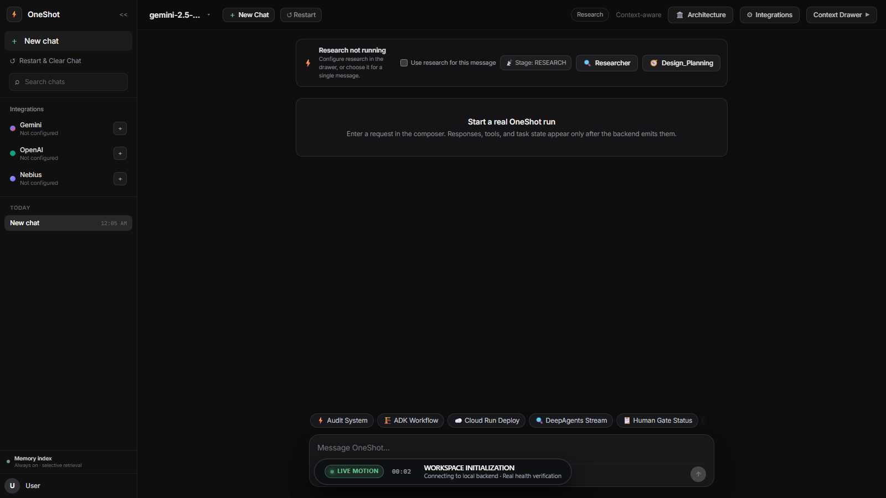
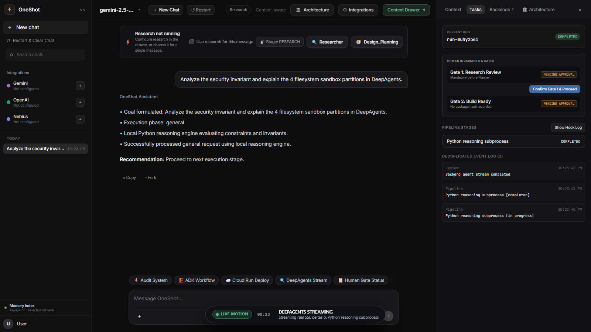

<div align="left">

# OneShot

<p>
  <a href="https://raw.githubusercontent.com/itz1508/oneshot_e2e/main/scripts/install.ps1">
    
  </a>
</p>

<p>
  
  
  
  
</p>

</div>

---

## ⚡ One Click Installation — Launch Server

**Windows (PowerShell — one command, fully automatic):**

```powershell
irm https://raw.githubusercontent.com/itz1508/oneshot_e2e/main/scripts/install.ps1 | iex
```

**macOS / Linux:**

```bash
curl -fsSL https://raw.githubusercontent.com/itz1508/oneshot_e2e/main/scripts/install.sh | bash
```

> The installer automatically: clones the repo → installs dependencies → compiles → discovers an open port → **launches the browser console ready for testing**. Zero configuration required.

---

## 🖥️ Live UI — Prompt · Stream · Task Rail

<div align="left">
  <a href="public/demo/oneshot-demo.webm">
    
  </a>
  <br />
  <sub>▶ <b><a href="public/demo/oneshot-demo.webm">Watch the live capture</a></b><br />Fresh prompt → real backend HTTP stream → Python reasoning deltas → completed response → live Task drawer. The recording ends when the real run completes.</sub>
</div>

---

### 📸 Live Event Progression

| 1. Loading Workspace | 2. Prompt Composer |
|:---|:---|
| <br /><sub><b>Loading state</b>: Workspace is fetching real backend state</sub> | <br /><sub><b>Prompt entry</b>: Actual user request in the composer</sub> |

| 3. Live Python Reasoning Stream | 4. Completed Response |
|:---|:---|
| <br /><sub><b>Live state</b>: Backend stream and Python reasoning deltas</sub> | <br /><sub><b>Completed run</b>: The backend stream finished</sub> |

| 5. Task and Hook State |
|:---|
| <br /><sub><b>Task state</b>: Real run lifecycle, pending gates, and emitted events</sub> |

---

## 🏛️ System Architecture

<div align="left">
  
</div>

---

## 🔄 How It Works

| Step | What happens |
|------|-------------|
| **1. Enter prompt** | Type your task in the Prompt Composer and press Enter |
| **2. Python Reasoner streams** | The local Python reasoning subprocess streams real output without requiring API keys |
| **3. Task state updates** | The task drawer shows the active run, lifecycle steps, pending gates, and emitted events |
| **4. Human gates** | Gate 1 and Gate 2 remain explicit until a real human confirmation changes backend state |
| **5. Run completes** | The stream ends with the backend’s actual `RUN_FINISH` event |

---

## 📦 Manual Install & Run

```bash
# Clone
git clone https://github.com/itz1508/oneshot_e2e.git
cd oneshot_e2e

# Install all dependencies
pnpm install

# Build backend + frontend
pnpm run build

# Launch server (auto-detects port, opens browser)
pnpm start
```

**Windows shortcut:**
```powershell
.\scripts\start-web.ps1          # default port 8787
.\scripts\start-web.ps1 -Port 9000 -Sample   # custom port + sample data
```

---

## 🧪 Run Tests & Verification

```bash
# Backend tests — asserts actual response payloads & fixture proofs
pnpm test

# Workflow engine & state machine tests
pnpm run test:runtime

# Web frontend tests
pnpm --prefix frontend/web test

# Full repository verification suite (7/7 checks)
pnpm run verify
```

> **Requirements:** Node.js `>= 24.21.0` · pnpm `>= 11.27.1`

---

## 🔑 Optional: Connect Live Model Providers

```bash
# Set your API key, then launch
export GEMINI_API_KEY="your-gemini-api-key"
pnpm run oneshot
```

Or configure **Google Gemini**, **OpenAI**, **Nebius**, **Mistral**, or local **Ollama** directly in the **Integrations** drawer inside the web UI — no restart required.

---

## License

[Apache-2.0](LICENSE)
