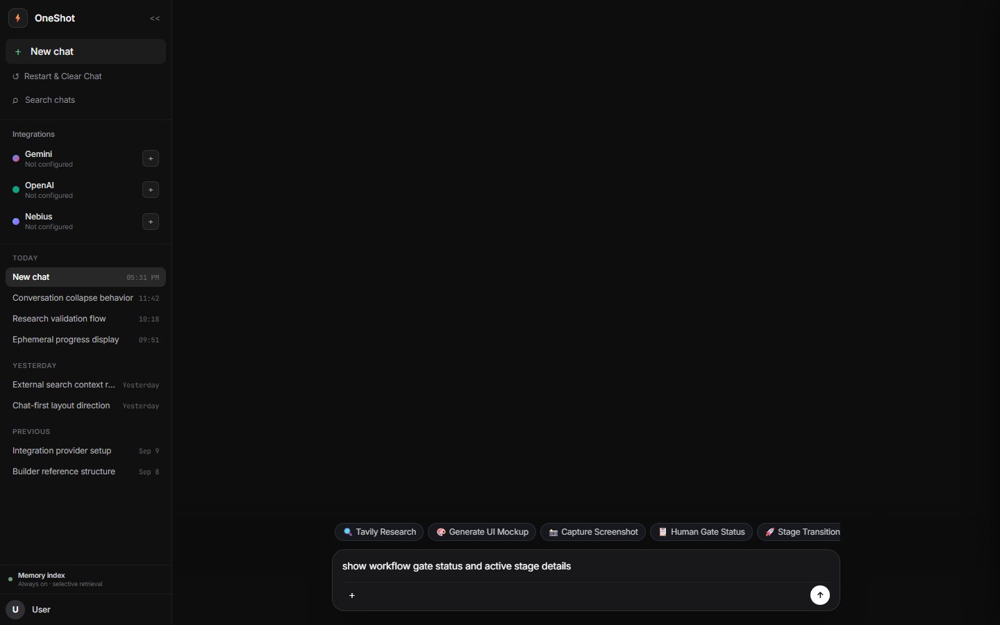
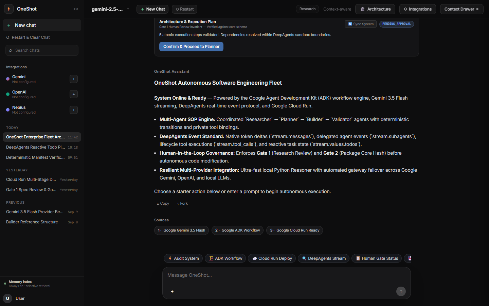
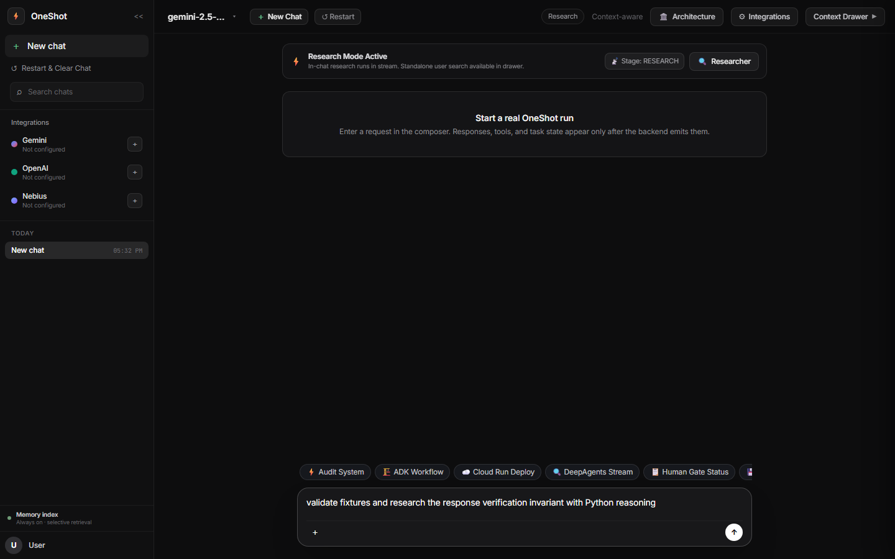
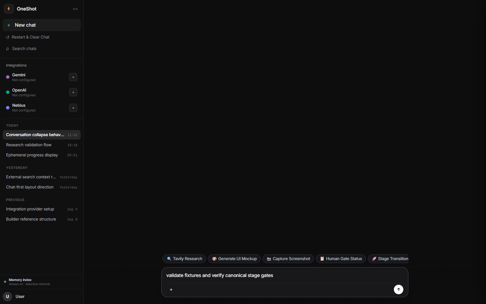
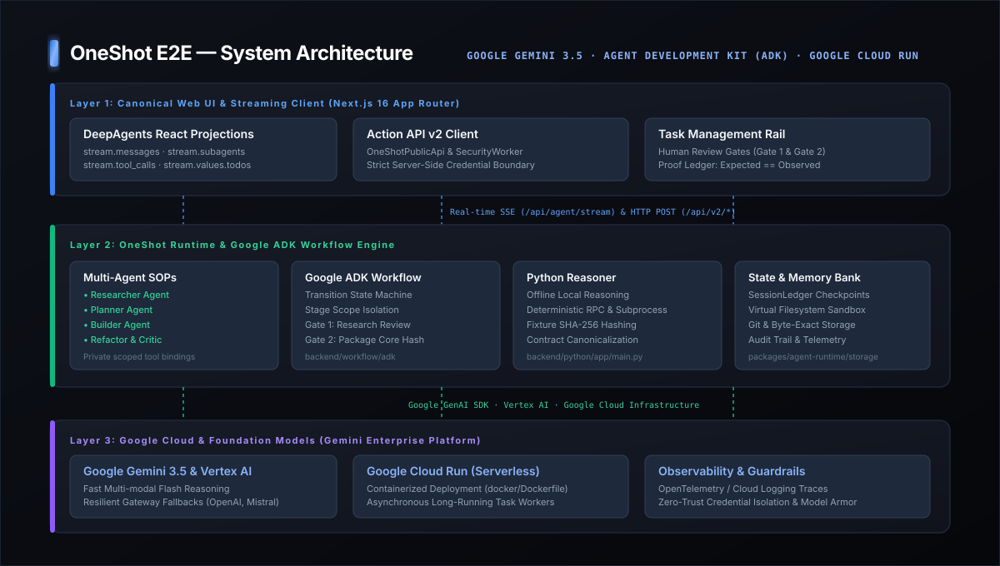

<div align="center">

# OneShot

**Automatic end-to-end agent testing — one command to install, run, and verify.**

<p>
  <a href="https://raw.githubusercontent.com/itz1508/oneshot_e2e/main/scripts/install.ps1">
    
  </a>
</p>

<p>
  
  
  
  
</p>

</div>

---

## ⚡ One Click Installation — Launch Server

**Windows (PowerShell — one command, fully automatic):**

```powershell
irm https://raw.githubusercontent.com/itz1508/oneshot_e2e/main/scripts/install.ps1 | iex
```

**macOS / Linux:**

```bash
curl -fsSL https://raw.githubusercontent.com/itz1508/oneshot_e2e/main/scripts/install.sh | bash
```

> The installer automatically: clones the repo → installs dependencies → compiles → discovers an open port → **launches the browser console ready for testing**. Zero configuration required.

---

## 🖥️ Live UI — Prompt · Stream · Task Rail

<div align="center">
  <a href="public/demo/oneshot-demo.webm">
    
  </a>
  <br />
  <sub>▶ <b><a href="public/demo/oneshot-demo.webm">Click to watch the full 60-second walkthrough video (oneshot-demo.webm)</a></b><br />Left: model picker & session navigation &nbsp;·&nbsp; Center: live streaming response with Python reasoner &nbsp;·&nbsp; Right: Task Rail with verified gates</sub>
</div>

---

### 📸 Live Event Progression

| 1. Context & Workspace | 2. Prompt & Planning Gate |
|:---:|:---:|
| <br /><sub><b>Initial UI</b>: Preserved context & model selection</sub> | <br /><sub><b>Composer</b>: Architecture plan & human review gate</sub> |

| 3. Live Python Reasoning Stream | 4. Deterministic Proof & Task Rail |
|:---:|:---:|
| <br /><sub><b>Zero-Config Stream</b>: Real Python reasoning tokens</sub> | <br /><sub><b>Task Rail</b>: Gate 1 & 2 approved, proof confirmed</sub> |

---

## 🏛️ System Architecture

<div align="center">
  
</div>

---

## 🔄 How It Works

| Step | What happens |
|------|-------------|
| **1. Enter prompt** | Type your task in the Prompt Composer and press Enter |
| **2. Python Reasoner streams** | Zero-config standalone Python reasoner streams real tokens without requiring API keys |
| **3. Task Rail fires** | Right panel shows live stage events: Research → Planning → Build → Review |
| **4. Human gates** | Review cards enforce Gate 1 (Research Review) and Gate 2 (Build Ready) before transitions |
| **5. Result persists** | Deterministic fixture validation (`Expected == Observed`) and immutable records saved |

---

## 📦 Manual Install & Run

```bash
# Clone
git clone https://github.com/itz1508/oneshot_e2e.git
cd oneshot_e2e

# Install all dependencies
pnpm install

# Build backend + frontend
pnpm run build

# Launch server (auto-detects port, opens browser)
pnpm start
```

**Windows shortcut:**
```powershell
.\scripts\start-web.ps1          # default port 8787
.\scripts\start-web.ps1 -Port 9000 -Sample   # custom port + sample data
```

---

## 🧪 Run Tests & Verification

```bash
# Backend tests — asserts actual response payloads & fixture proofs
pnpm test

# Workflow engine & state machine tests
pnpm run test:runtime

# Web frontend tests
pnpm --prefix frontend/web test

# Full repository verification suite (7/7 checks)
pnpm run verify
```

> **Requirements:** Node.js `>= 24.13.0` · pnpm `>= 10.0.0`

---

## 🔑 Optional: Connect Live Model Providers

```bash
# Set your API key, then launch
export GEMINI_API_KEY="your-gemini-api-key"
pnpm run oneshot
```

Or configure **OpenAI**, **Anthropic**, and other providers directly in the **Integrations** drawer inside the web UI — no restart required.

---

## License

[Apache-2.0](LICENSE)
