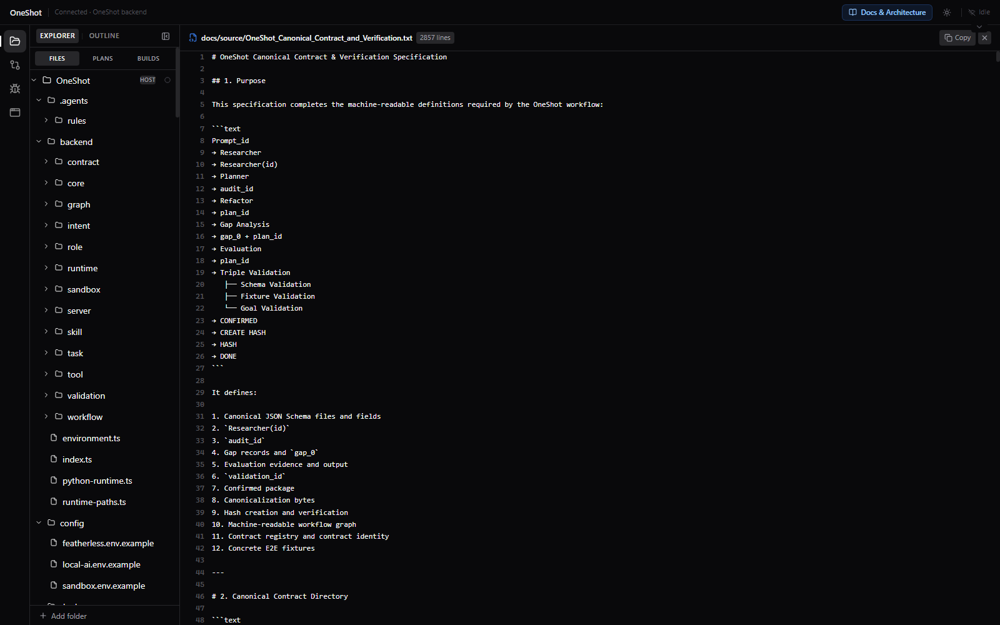

# OneShot Production E2E 1.3.0

Deterministic AI execution platform that transforms natural language intent into a provably correct, cryptographically verified execution plan using strict Draft 2020-12 schema contracts, verifiable AI research engines (Google ADK & Gemma 2), triple validation gates (Schema, Fixture, Goal), RFC 8785 canonicalization, SHA-256 cryptographic proofs, and an interactive React IDE.

> [!IMPORTANT]
> **📋 Hackathon Judges:** For the standalone zero-dependency evaluation guide (under 60 seconds with prebuilt Docker image), please refer directly to [**`JUDGE_README.md`**](JUDGE_README.md).

---

## 🎬 Instant Video Demonstration & Walkthrough

Review the full end-to-end execution, task drawer telemetry, live activity disclosures, and proof generation in under 60 seconds:

- 📺 **Watch Video Demonstration on YouTube:** [https://www.youtube.com/watch?v=RQTxYwcNx_0](https://www.youtube.com/watch?v=RQTxYwcNx_0)
- 📁 **Direct Local MP4 File:** [`docs/OneShot_Task_Drawer_Compatibility_Fixed.mp4`](docs/OneShot_Task_Drawer_Compatibility_Fixed.mp4)

<video width="100%" max-width="880px" controls autoplay muted loop playsinline preload="auto">
  <source src="docs/OneShot_Task_Drawer_Compatibility_Fixed.mp4" type="video/mp4">
  Your browser does not support the video tag. You can watch the demonstration on YouTube at <a href="https://www.youtube.com/watch?v=RQTxYwcNx_0">https://www.youtube.com/watch?v=RQTxYwcNx_0</a> or view the local video file at <a href="docs/OneShot_Task_Drawer_Compatibility_Fixed.mp4">docs/OneShot_Task_Drawer_Compatibility_Fixed.mp4</a>.
</video>

---

<details open>
<summary><b>📖 Table of Contents</b> (click to expand / collapse)</summary>

- [⚡ Simple Installation & Quick Start](#-simple-installation--quick-start)
  - [Prerequisites](#prerequisites)
  - [Option A: 1-Click Fast-Path (Recommended)](#option-a-1-click-fast-path-recommended)
  - [Option B: One-Command Source Launch](#option-b-one-command-source-launch)
  - [Run Verification Suite](#run-verification-suite)
- [✨ Product Features & Interface](#-product-features--interface)
  - [Key Capabilities](#key-capabilities)
  - [Visual Product Tour](#visual-product-tour)
- [🗺️ Google ADK 2.0 Workflow Graph](#️-google-adk-20-workflow-graph)
  - [Canonical State Machine Flow](#canonical-state-machine-flow)
  - [Triple Validation Nested Workflow](#triple-validation-nested-workflow)
- [🛡️ Product Details & Verification Matrix](#️-product-details--verification-matrix)
  - [Multi-Tier Ownership Architecture](#multi-tier-ownership-architecture)
  - [Master Verification Gate Results](#master-verification-gate-results)
- [📚 Key Architecture & Documentation Links](#-key-architecture--documentation-links)

</details>

---

## ⚡ Simple Installation & Quick Start

### Prerequisites

- **Docker Desktop** (for Option A) **OR** **Node.js $\ge 20$ + Python $\ge 3.11$** (for Option B).

---

### Option A: 1-Click Fast-Path (Recommended)

No repository cloning, Python setup, or local compilation is required:

- **Windows**: `.\start-oneshot.ps1`
- **macOS / Linux**: `chmod +x ./start-oneshot.sh && ./start-oneshot.sh`

The launcher loads the prebuilt image, generates a local session token in `.env`, starts Docker Compose (non-root, resource-limited), waits for the container healthcheck, and automatically opens **`http://localhost:8787`**.

---

### Option B: One-Command Source Launch

If running directly from repository source code:

```bash
git clone https://github.com/itz1508/oneshot_e2e.git
cd oneshot_e2e
npm run oneshot
```

`npm run oneshot` creates `.venv`, installs locked dependencies, compiles the strict TypeScript backend and Vite frontend, verifies canonical contracts and `MANIFEST.sha256`, runs the full test suite, starts the HTTP server, and opens `http://localhost:8787`.

---

### Run Verification Suite

```bash
# Run all 49 Python and 51 TypeScript tests
npm run verify

# Run React IDE Vitest unit tests (104 tests)
npm --prefix web test

# Verify source hash manifest integrity (471 files)
python scripts/verify_manifest.py
```

---

## ✨ Product Features & Interface

### Key Capabilities

- **Deterministic AI State Machine**: 27-phase monotonic state machine with rigid stage ownership and immutable artifacts.
- **Strict Schema Contracts**: 21 JSON Schema Draft 2020-12 contracts governing all payloads, events, and validation results.
- **Verifiable AI Research**: Integrated Google ADK with Ollama (`gemma2:9b`) and Featherless (`google/gemma-4-31B-it`).
- **Triple Validation Gates**: Parallel evaluation of Schema, Fixture, and Goal validation barriers before package confirmation.
- **Cryptographic Hash Verification**: RFC 8785 canonicalization (JCS) with SHA-256 equality proof (`created_hash == recomputed_hash`).
- **Isolated Sandbox Execution**: Resource-constrained, network-isolated execution sandbox with deterministic evidence capture.
- **Modern Event-Driven IDE**: Real-time Server-Sent Events (SSE) streaming, collapsible task drawer telemetry, live activity disclosures, and integrated documentation viewer.

### Visual Product Tour

| Continuous Conversational Session & Task Drawer | Welcome Hub with Embedded Video Walkthrough |
| --- | --- |
|  |  |

| Interactive Code Fix & Diff Editor | Native Draft 2020-12 Contract Specification |
| --- | --- |
|  |  |

---

## 🗺️ Google ADK 2.0 Workflow Graph

### Canonical State Machine Flow

The OneShot execution engine coordinates Google ADK 2.0 graph routing with deterministic Python validation gates, RFC 8785 canonicalization, and SHA-256 cryptographic proofs:

```text
START
  ↓
USER
  ↓
CHAT
  ↓
INTENT READY
  ↓
GENERATOR
  ↓
Prompt_id  (recorded under JOB_ID)
  ↓
RESEARCHER
  ↓
Researcher(id)
  ├─ plan_id
  ├─ schema_id
  ├─ fixture_id
  ├─ goal_id
  └─ validation_id
  ↓
PLANNER
  ├─ input: plan_id
  └─ output: audit_id
  ↓
REFACTOR / REFINEMENT
  ├─ input: plan_id + audit_id
  └─ output: SAME plan_id with revision/evidence update
  ↓
GAP ANALYSIS
  ├─ inspect updated plan_id
  ├─ correct gaps
  ├─ fresh recheck
  └─ gap_0 + FINAL plan_id
  ↓
EVALUATION
  └─ PASSED | ROOT_CAUSE
  ↓
TRIPLE VALIDATION (Google ADK Workflow + JoinNode)
  ├─ Schema Validation:   FINAL plan_id + schema_id  → VALID | NOT_VALID
  ├─ Fixture Validation:  FINAL plan_id + fixture_id → VALID | NOT_VALID
  └─ Goal Validation:     FINAL plan_id + goal_id    → VALID | NOT_VALID
  ↓
all_valid = (schema == VALID) AND (fixture == VALID) AND (goal == VALID)
  ↓
CONFIRMED
  ↓
confirmed_package.core
  ↓
CREATE HASH
  ├─ RFC 8785 JCS Canonicalization
  └─ SHA-256 → created_hash
  ↓
PROMOTE  (Researcher(id) FINAL → Job confirmed)
  ↓
BUILDER
  ├─ exact confirmed immutable package
  └─ created_hash
  ↓
BUILD RESULT / SANDBOX EXECUTION
  ↓
RECOMPUTE HASH
  ├─ same confirmed_package.core definition
  ├─ RFC 8785 JCS
  └─ SHA-256 → recomputed_hash
  ↓
HASH VERIFICATION (created_hash == recomputed_hash)
  ↓
DONE → PASSED
```

### Triple Validation Nested Workflow

```text
Evaluation
    │
    ▼
Triple Validation Workflow
    ├───────────────┬───────────────┐
    ▼               ▼               ▼
Schema           Fixture          Goal
Validation       Validation       Validation
    │               │               │
    └───────────────┼───────────────┘
                    ▼
                 JoinNode (Fan-In Barrier)
                    │
                    ▼
           deterministic all_valid
                    │
          all 3 results == VALID
                    │
                    ▼
                CONFIRMED
```

---

## 🛡️ Product Details & Verification Matrix

### Multi-Tier Ownership Architecture

- **`schema/`**: 21 Draft 2020-12 schemas defining canonical contracts.
- **`validation/`**: Python canonicalization (RFC 8785), SHA-256 hashing, and fixture execution.
- **`workflow/`**: Google ADK 2.0 workflow graph topology and JoinNode fan-in barrier specifications.
- **`backend/`**: Strict TypeScript runtime, append-only event store, and HTTP/SSE server.
- **`web/`**: Event-driven React IDE with real-time SSE stream consumption.

### Master Verification Gate Results

```text
======================================================================
ONE-SHOT PRODUCTION E2E 1.3.0 - MASTER VERIFICATION SUMMARY
======================================================================
  [PASS] Python Unit Suite:            49 / 49 tests passed
  [PASS] TypeScript E2E Suite:         51 / 51 tests passed
  [PASS] React IDE Vitest Suite:       104 / 104 tests passed
  [PASS] Checksum Manifest Integrity:  471 / 471 files verified
  [PASS] Docker Packaging & Runtime:   5 / 5 container tests passed
======================================================================
  STATUS: ONESHOT_PRODUCTION_E2E_VERIFIED (100% PASS)
======================================================================
```

---

## 📚 Key Architecture & Documentation Links

| Document | Format | Description |
| --- | --- | --- |
| [**`JUDGE_README.md`**](JUDGE_README.md) | Guide | **Hackathon Judge Evaluation Guide**: Fast-path demonstration and zero-install Docker instructions. |
| [`workflow/WorkflowGraph_corrected_optimized.txt`](workflow/WorkflowGraph_corrected_optimized.txt) | Spec | **Google ADK 2.0 Workflow Graph**: Canonical ADK graph topology, JoinNode fan-in, and triple validation gate. |
| [`docs/INDEX.md`](docs/INDEX.md) | Markdown | **Master Documentation Index**: Complete catalog of all specifications and guides. |
| [`docs/WORKFLOW_TREE`](docs/WORKFLOW_TREE) | ASCII Tree | **Source of Truth Execution Hierarchy**: Immutable sequence from Intent → Triple Validation → Hash → Sandbox. |
| [`docs/WORKFLOW_TREE.pdf`](docs/WORKFLOW_TREE.pdf) | PDF Diagram | **Visual Workflow Architecture**: Visual diagram of canonical stages and validation gates. |
| [`docs/source/OneShot_Canonical_Contract_and_Verification.txt`](docs/source/OneShot_Canonical_Contract_and_Verification.txt) | Draft 2020-12 Spec | **Canonical Contracts & Verification**: Schemas, audit IDs, triple validation, and hash proof definitions. |
| [`CANONICAL_WORKFLOW.md`](CANONICAL_WORKFLOW.md) | Workflow Spec | **Canonical Workflow Order**: Role separation (`ROLE != SKILL != TOOL != WORKFLOW`) and proof requirements. |

---

## 📄 License

Licensed under the **Apache License, Version 2.0**. See [`LICENSE`](LICENSE) for details.
