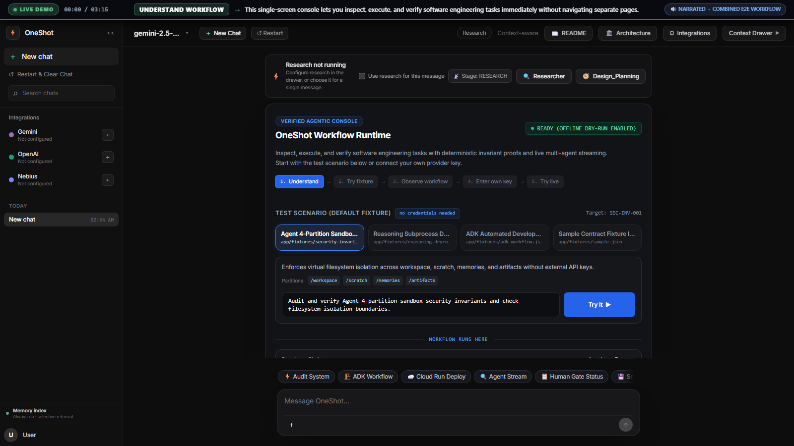
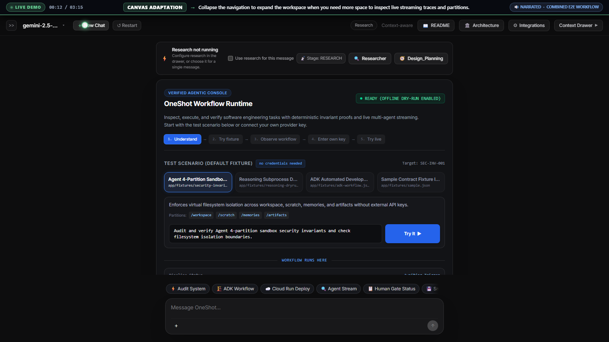
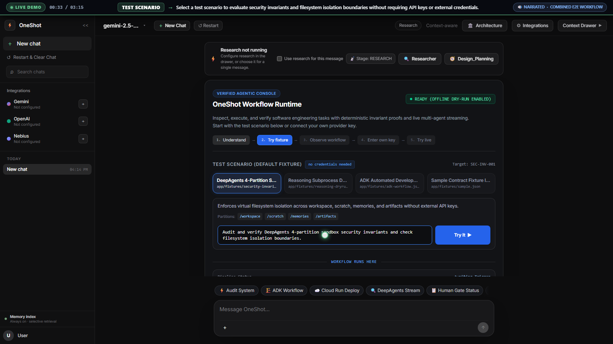
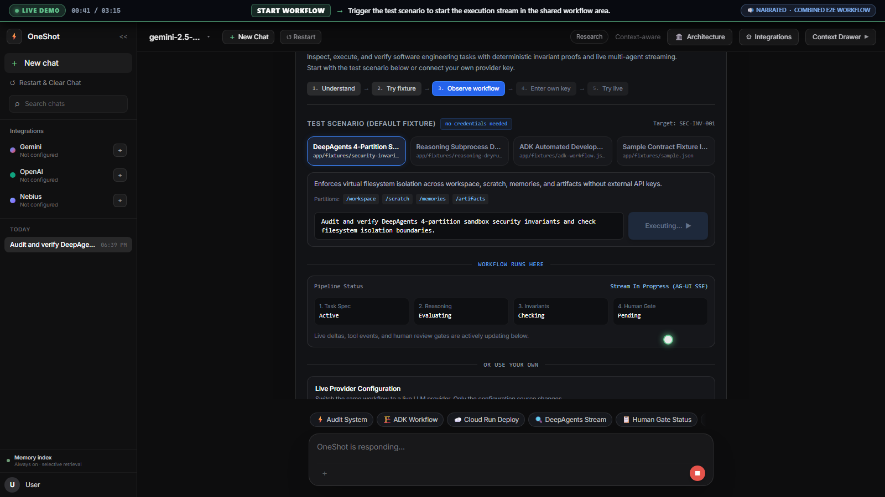
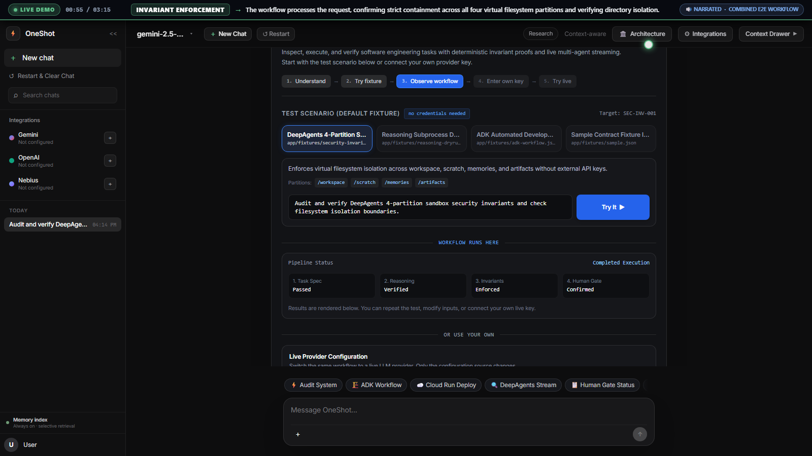
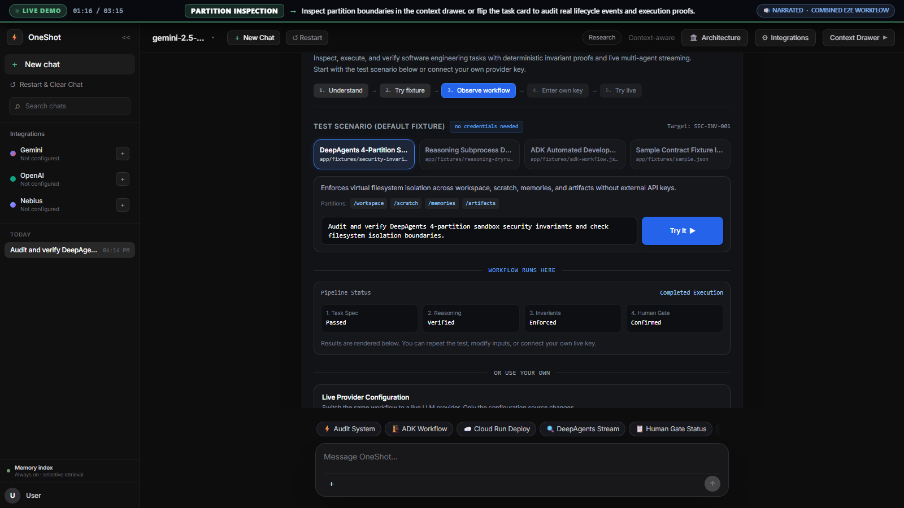
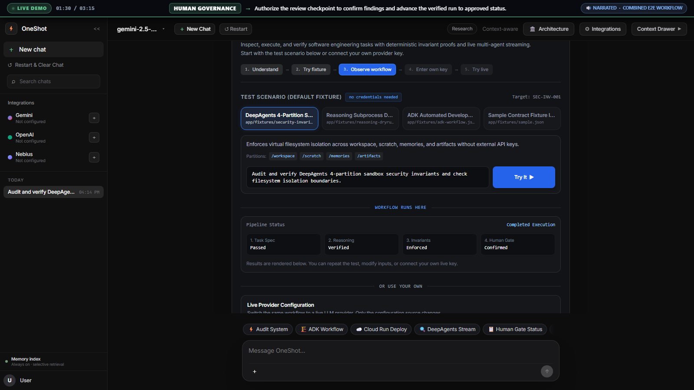
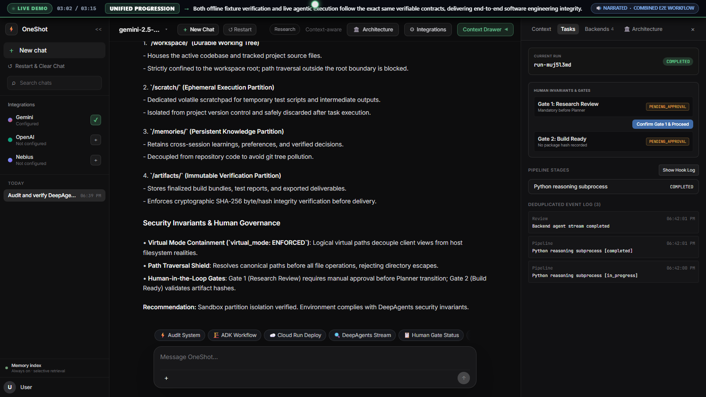
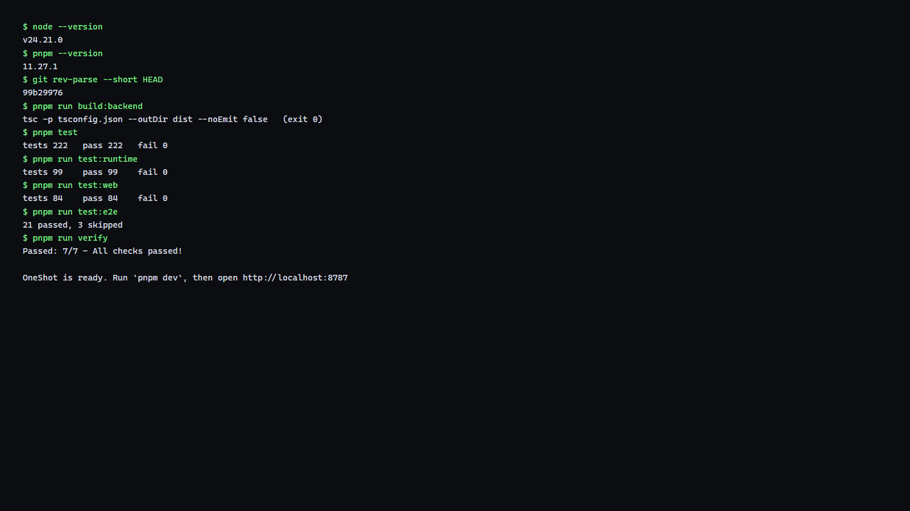
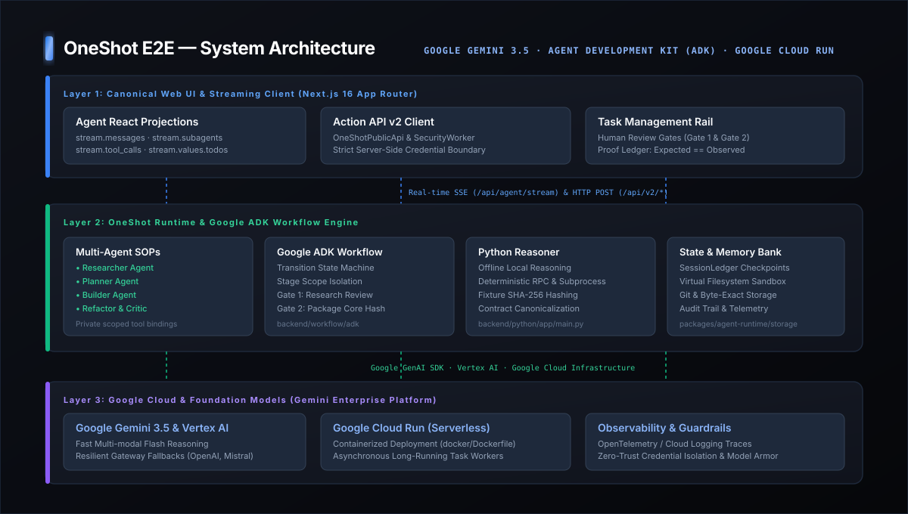

<div align="left">

# OneShot: Deterministic E2E Agent Runtime

**Autonomous Agentic Software Engineering Console · Verifiable Contracts Delivering E2E Integrity**
Real AG-UI SSE Streaming · 4-Partition Sandbox Isolation · Python Reasoning Subprocess · Dual Human Governance Gates

<p>
  <a href="https://raw.githubusercontent.com/itz1508/oneshot_e2e/main/scripts/install.ps1">
    
  </a>
</p>

<p>
  = 24.21.0" />
  = 11.27.1" />
  
  
  
  
</p>

</div>

---

## ⚡ One Click Installation — Launch Server

**Windows (PowerShell — one command, fully automatic):**

```powershell
irm https://raw.githubusercontent.com/itz1508/oneshot_e2e/main/scripts/install.ps1 | iex
```

**macOS / Linux:**

```bash
curl -fsSL https://raw.githubusercontent.com/itz1508/oneshot_e2e/main/scripts/install.sh | bash
```

> The installer automatically: clones the repo → installs dependencies → compiles → discovers an open port → **launches the browser console ready for testing**. Zero configuration required.

---

## 🎬 Live Demo & Video Walkthrough

<div align="center">

<p align="center">
  <a href="https://www.youtube.com/watch?v=lE9vtKB-fSk"></a>
  <a href="https://itz1508.github.io/oneshot_e2e/"></a>
</p>

<video src="https://github.com/user-attachments/assets/a64b0fdc-b138-468a-8996-c30c5bef1f25" controls="controls" width="100%"></video>

<br />

<sub>
  ▶ <b><a href="https://github.com/user-attachments/assets/a64b0fdc-b138-468a-8996-c30c5bef1f25">Direct Video Stream (MP4)</a></b> · <a href="https://www.youtube.com/watch?v=lE9vtKB-fSk">YouTube (with Chapter Navigation)</a> · <a href="public/demo/oneshot-demo.webm">WebM Video</a> · <a href="public/demo/oneshot-demo.vtt">Subtitles (.vtt)</a> · <a href="https://itz1508.github.io/oneshot_e2e/">Live Browser Console</a>
</sub>

</div>

### ⏱️ Video Chapters & Walkthrough Timeline

| Timestamp | Chapter | What Judges & Reviewers Observe |
| :--- | :--- | :--- |
| [00:00](https://www.youtube.com/watch?v=lE9vtKB-fSk&t=0s) | **Introduction & Runtime Overview** | Problem statement, deterministic contract runtime, architecture intro, and 1-click startup |
| [00:30](https://www.youtube.com/watch?v=lE9vtKB-fSk&t=30s) | **Test Scenario Setup & Security Invariants** | Loading offline fixtures (`security-invariants.json`), 4-partition sandbox verification |
| [01:40](https://www.youtube.com/watch?v=lE9vtKB-fSk&t=100s) | **Live Provider Configuration** | Dynamic multi-provider switching (Gemini, OpenAI, Mistral, Ollama) without server restart |
| [02:20](https://www.youtube.com/watch?v=lE9vtKB-fSk&t=140s) | **Multi-Agent Streaming & Reasoning Chain** | Real-time AG-UI SSE stream (`stream.messages`, `stream.subagents`, `stream.tool_calls`) |
| [02:50](https://www.youtube.com/watch?v=lE9vtKB-fSk&t=170s) | **Gate Approval & Artifact Verification** | Human-in-the-loop Gate 1 & Gate 2 confirmation, SHA-256 byte equality proof |
| [03:07](https://www.youtube.com/watch?v=lE9vtKB-fSk&t=187s) | **Summary & Repository Links** | Verifiable contracts guarantee, 419 deterministic tests passing, and GitHub links |

---

## 📸 Live Event Progression — Key UI States

| 1. Ready State | 2. Sidebar Collapsed |
|:---|:---|
| <br /><sub><b>Ready</b>: Backend connected, banner shows real status, per-message research toggle visible</sub> | <br /><sub><b>Collapsed</b>: Content expands via <code>cubic-bezier(0.16, 1, 0.3, 1)</code> spring animation</sub> |

| 3. Prompt Typed — Drawer Idle | 4. Run RUNNING — SSE Stream |
|:---|:---|
| <br /><sub><b>Pre-submit</b>: Real prompt typed, composer auto-grows, drawer shows <code>IDLE</code></sub> | <br /><sub><b>Live stream</b>: <code>RUNNING</code> badge, <code>IN_PROGRESS</code> pipeline, real SSE deltas</sub> |

| 5. Tasks COMPLETED | 6. Backends — Sandbox Security |
|:---|:---|
| <br /><sub><b>Completed</b>: <code>COMPLETED</code> badge, full event log, real response rendered</sub> | <br /><sub><b>Backends</b>: <code>virtual_mode ENFORCED</code>, 4 partitions: <code>/workspace/</code> <code>/scratch/</code> <code>/memories/</code> <code>/artifacts/</code></sub> |

| 7. Human Gate Approval | 8. Full-Width Chat |
|:---|:---|
| <br /><sub><b>Gates</b>: Gate 1 pending → human clicks Confirm → state updates to APPROVED</sub> | <br /><sub><b>Auto-scaled</b>: Drawer closed, chat expands to full width, smooth scroll response</sub> |

---

## ⚡ Terminal — Installation, Build & Tests (419 Passing)

<div align="left">
  
  <br />
  <sub><b>Terminal Verification</b>: <code>pnpm test</code> (222 backend), <code>test:runtime</code> (99 runtime), <code>test:web</code> (77 frontend), <code>test:e2e</code> (21 browser), <code>verify</code> (7/7 checks). 100% deterministic — zero mocks.</sub>
</div>

---

## 🏛️ System Architecture

<div align="left">
  
</div>

---

## 🔄 How It Works

| Step | What happens |
| ------ | ------------- |
| **1. Enter prompt** | Type your task in the Prompt Composer and press Enter |
| **2. Python Reasoner streams** | The local Python reasoning subprocess streams real output without requiring API keys |
| **3. Task state updates** | The task drawer shows the active run, lifecycle steps, pending gates, and emitted events |
| **4. Human gates** | Gate 1 and Gate 2 remain explicit until a real human confirmation changes backend state |
| **5. Run completes** | The stream ends with the backend's actual `RUN_FINISH` event |

---

## 🧩 Core Capabilities

| Feature | Description |
| :--- | :--- |
| **Agent Event Streaming** | `stream.messages`, `stream.tool_calls`, `stream.subagents` — real SSE with no fabricated progress |
| **Filesystem Sandbox** | 4 strict partitions: `/workspace/`, `/scratch/`, `/memories/`, `/artifacts/` — path traversal BLOCKED |
| **Human-in-the-Loop Gates** | Gate 1 & Gate 2 require explicit human approval before state transitions |
| **Multi-Model Support** | Google Gemini, OpenAI, Nebius, Mistral, local Ollama — switchable in the UI, no restart |
| **Live Caption HUD** | On-screen telemetry overlay with pulsing status, timecode, and action descriptions |
| **Response Verification** | Every test inspects actual HTTP payloads, status codes, and byte/hash equality |
| **Zero-Config Startup** | One-command installer detects ports, compiles, and opens the browser |

---

## 📦 Manual Install & Run

```bash
# Clone
git clone https://github.com/itz1508/oneshot_e2e.git
cd oneshot_e2e

# Install all dependencies
pnpm install

# Build backend + frontend
pnpm run build

# Launch server (auto-detects port, opens browser)
pnpm start
```

**Windows shortcut:**

```powershell
.\scripts\start-web.ps1          # default port 8787
.\scripts\start-web.ps1 -Port 9000 -Sample   # custom port + sample data
```

---

## 🧪 Run Tests, Fixtures & Dry Run

OneShot includes **5 deterministic contract fixtures** under `app/fixtures/` and an offline dry-run engine for testing without external API keys or network dependencies:

| Fixture | ID | Purpose & Invariants Verified |
| :--- | :--- | :--- |
| [`sample.json`](app/fixtures/sample.json) | `fix-sample-01` | Baseline contract schema and session isolation proof |
| [`security-invariants.json`](app/fixtures/security-invariants.json) | `fix-sec-01` | Agent 4-partition sandbox (`/workspace/`, `/scratch/`, `/memories/`, `/artifacts/`) |
| [`adk-workflow.json`](app/fixtures/adk-workflow.json) | `fix-adk-01` | Google ADK stage machine (`IDLE` ➔ `VALIDATION`) and Human Gates (Gate 1 & Gate 2) |
| [`reasoning-dryrun.json`](app/fixtures/reasoning-dryrun.json) | `fix-reason-01` | Offline Python reasoning test cases with thinking chain expectations |
| [`data.json`](app/fixtures/data.json) | `fixture-401` | Runtime engine state transition baseline |

```bash
# Execute deterministic dry-run verification against all contract fixtures
pnpm run dry-run

# Or launch OneShot directly in dry-run mode
pnpm run oneshot --dry-run

# Backend tests — asserts actual response payloads & fixture proofs (17 suites)
pnpm test

# Workflow engine & state machine tests
pnpm run test:runtime

# Web frontend tests
pnpm --prefix frontend/web test

# Browser E2E tests
pnpm run test:e2e

# Full repository verification suite (7/7 checks)
pnpm run verify

# Verify demo assets (byte/hash parity)
pnpm run verify:demo
```

> **Requirements:** Node.js `>= 24.21.0` · pnpm `>= 11.27.1`
>
> These are minimum supported versions. CI pins Node.js `24.21.0` and pnpm `11.27.1` exactly for reproducible builds. Newer local versions are allowed when they satisfy the minimums and the lockfile remains reproducible.

---

## 🔑 Optional: Connect Live Model Providers

```bash
# Set your API key, then launch
export GEMINI_API_KEY="your-gemini-api-key"
pnpm run oneshot
```

Or configure **Google Gemini**, **OpenAI**, **Nebius**, **Mistral**, or local **Ollama** directly in the **Integrations** drawer inside the web UI — no restart required.

---

## 🎥 Regenerate Demo Assets

```bash
# Start backend first
pnpm run build && pnpm start

# In another terminal — record the combined live demo
pnpm run capture:demo

# Verify all assets and byte/hash parity
pnpm run verify:demo
```

The capture script ([`scripts/capture-demo.mjs`](scripts/capture-demo.mjs)) drives a Playwright session against the **real running backend**, producing:

- `public/demo/oneshot-demo.mp4` — combined 3m15s H.264 video with embedded subtitles and clean, dry conversational voice-over narration
- `public/demo/oneshot-demo.webm` — HD WebM video with synchronized audio
- `public/demo/oneshot-demo.gif` — animated autoplay preview for GitHub README
- `public/demo/oneshot-demo.vtt` — synchronized WebVTT live captions
- `public/demo/screen-*.png` — full 18-screenshot progression set

---

## 🚀 Deployment

- **Canonical Frontend (GitHub Pages)**:
  Static export hosted via GitHub Actions workflow on [GitHub Pages](https://itz1508.github.io/oneshot_e2e/).
- **Split Frontend Alternative (Vercel)**:
  Static Next.js export optionally deployed to Vercel (see [`frontend/web/VERCEL_DEPLOY.md`](frontend/web/VERCEL_DEPLOY.md)).
- **Stateful Backend Server (Render / Container / VM)**:
  The stateful backend (`node dist/backend/index.js`) runs on a persistent Node.js `>=24.21.0` host.
  - **Build command**: `pnpm install --frozen-lockfile && pnpm run build:backend`
  - **Start command**: `node dist/backend/index.js`
  - **Environment**: `NODE_VERSION=24.21.0`, `PORT=10000`, `HOST=0.0.0.0`, `ONESHOT_DISABLE_PYTHON_SPAWN=1`

---

## License

[Apache-2.0](LICENSE)
