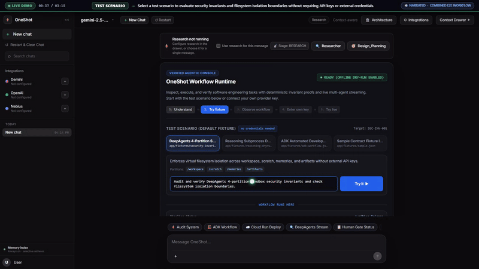

<div align="left">

# OneShot

**The Autonomous Agentic Software Engineering Console**
Real SSE Streaming · Python Reasoning Subprocess · Strict Filesystem Sandboxing · Human-in-the-Loop Governance

<p>
  <a href="https://raw.githubusercontent.com/itz1508/oneshot_e2e/main/scripts/install.ps1">
    
  </a>
</p>

<p>
  = 24.21.0" />
  = 11.27.1" />
  
  
  
  
</p>

</div>

---

## ⚡ One Click Installation — Launch Server

**Windows (PowerShell — one command, fully automatic):**

```powershell
irm https://raw.githubusercontent.com/itz1508/oneshot_e2e/main/scripts/install.ps1 | iex
```

**macOS / Linux:**

```bash
curl -fsSL https://raw.githubusercontent.com/itz1508/oneshot_e2e/main/scripts/install.sh | bash
```

> The installer automatically: clones the repo → installs dependencies → compiles → discovers an open port → **launches the browser console ready for testing**. Zero configuration required.

---

## 🎬 Combined Live Demo — Full Agentic Lifecycle & Multi-Provider Workflow

<div align="center">
  <a href="public/demo/oneshot-demo.mp4">
    
  </a>
  <br />
  <sub>
    ▶ <b><a href="public/demo/oneshot-demo.mp4">Watch Combined Demo (MP4)</a></b> · <a href="public/demo/oneshot-demo.webm">WebM</a> · <a href="public/demo/oneshot-demo.vtt">Live Captions (.vtt)</a> · <a href="https://itz1508.github.io/oneshot_e2e/">GitHub Pages Live Site</a><br />
    Recorded live against the running backend — no mocks, no synthetic timers. 3 minutes and 15 seconds of continuous live action combining both the offline fixture verification suite (4 sandbox partitions, 3D hook audit ledger flip, and Gate 1 human approval) and the live agentic execution workflow (provider switching, research mode, key-by-key composer auto-growth, real-time SSE streaming, tool proofs, and Gate 2 verification).
  </sub>
</div>

### 🕐 Synchronized Video Transcript & Behavioral Timeline

Follows the canonical **Video & Demonstration Standard** — single synchronized transcript for voice-over and captions, describing system behavior and state transitions rather than component inventory:

| Timecode | Workflow Phase | Synchronized Caption & Spoken Voice-Over Narration |
| :--- | :--- | :--- |
| **00:00–00:14** | 1. Understand | This single-screen console lets you inspect, execute, and verify software engineering tasks immediately without navigating separate pages. |
| **00:14–00:27** | 2. Canvas Adaptation | Collapse the navigation to expand the workspace when you need more space to inspect live streaming traces and partitions. |
| **00:27–00:42** | 3. Test Scenario | Select a test scenario to evaluate security invariants and filesystem isolation boundaries without requiring API keys or external credentials. |
| **00:42–00:56** | 4. Start Workflow | Trigger the test scenario to start the execution stream in the shared workflow area. |
| **00:56–01:14** | 5. Observe Invariants | The workflow processes the request, confirming strict containment across all four virtual filesystem partitions and verifying directory isolation. |
| **01:14–01:30** | 6. Partitions & Ledger Flip | Inspect partition boundaries in the context drawer, or flip the task card to audit real lifecycle events and execution proofs. |
| **01:30–01:44** | 7. Human Governance | Authorize the review checkpoint to confirm findings and advance the verified run to approved status. |
| **01:44–02:00** | 8. Live Configuration | Switch seamlessly to live execution on the same screen by selecting your preferred provider and connecting your environment configuration. |
| **02:00–02:18** | 9. Research & Prompt | Enable context-aware research for the query and compose an engineering request. The input automatically expands to accommodate requirements. |
| **02:18–02:36** | 10. Multi-Agent Streaming | The live agent executes the request, emitting real-time streaming tokens, structured reasoning, and lifecycle status through the event stream. |
| **02:36–02:52** | 11. Tool Execution | Automated tools execute directly against workspace files, producing genuine output records and deterministic validation proofs. |
| **02:52–03:06** | 12. Gate 2 & Actions | Review the cryptographic build manifest, verify artifact hashes, and interact with the finalized response through copy or branching actions. |
| **03:06–03:15** | 13. Unified Progression | Both offline fixture verification and live agentic execution follow the exact same verifiable contracts, delivering end-to-end software engineering integrity. |

---

## 📸 Live Event Progression — Key UI States

| 1. Ready State | 2. Sidebar Collapsed |
|:---|:---|
| <br /><sub><b>Ready</b>: Backend connected, banner shows real status, per-message research toggle visible</sub> | <br /><sub><b>Collapsed</b>: Content expands via <code>cubic-bezier(0.16, 1, 0.3, 1)</code> spring animation</sub> |

| 3. Prompt Typed — Drawer Idle | 4. Run RUNNING — SSE Stream |
|:---|:---|
| <br /><sub><b>Pre-submit</b>: Real prompt typed, composer auto-grows, drawer shows <code>IDLE</code></sub> | <br /><sub><b>Live stream</b>: <code>RUNNING</code> badge, <code>IN_PROGRESS</code> pipeline, real SSE deltas</sub> |

| 5. Tasks COMPLETED | 6. Backends — Sandbox Security |
|:---|:---|
| <br /><sub><b>Completed</b>: <code>COMPLETED</code> badge, full event log, real response rendered</sub> | <br /><sub><b>Backends</b>: <code>virtual_mode ENFORCED</code>, 4 partitions: <code>/workspace/</code> <code>/scratch/</code> <code>/memories/</code> <code>/artifacts/</code></sub> |

| 7. Human Gate Approval | 8. Full-Width Chat |
|:---|:---|
| <br /><sub><b>Gates</b>: Gate 1 pending → human clicks Confirm → state updates to APPROVED</sub> | <br /><sub><b>Auto-scaled</b>: Drawer closed, chat expands to full width, smooth scroll response</sub> |

---

### ⚡ Terminal — Installation, Build & Tests (417 Passing)

<div align="left">
  
  <br />
  <sub><b>Terminal Verification</b>: <code>pnpm test</code> (221 backend), <code>test:runtime</code> (99 runtime), <code>test:web</code> (76 frontend), <code>test:e2e</code> (21 browser), <code>verify</code> (7/7 checks). 100% deterministic — zero mocks.</sub>
</div>

---

## 🏛️ System Architecture

<div align="left">
  
</div>

---

## 🔄 How It Works

| Step | What happens |
| ------ | ------------- |
| **1. Enter prompt** | Type your task in the Prompt Composer and press Enter |
| **2. Python Reasoner streams** | The local Python reasoning subprocess streams real output without requiring API keys |
| **3. Task state updates** | The task drawer shows the active run, lifecycle steps, pending gates, and emitted events |
| **4. Human gates** | Gate 1 and Gate 2 remain explicit until a real human confirmation changes backend state |
| **5. Run completes** | The stream ends with the backend's actual `RUN_FINISH` event |

---

## 🧩 Core Capabilities

| Feature | Description |
| :--- | :--- |
| **DeepAgents Event Streaming** | `stream.messages`, `stream.tool_calls`, `stream.subagents` — real SSE with no fabricated progress |
| **Filesystem Sandbox** | 4 strict partitions: `/workspace/`, `/scratch/`, `/memories/`, `/artifacts/` — path traversal BLOCKED |
| **Human-in-the-Loop Gates** | Gate 1 & Gate 2 require explicit human approval before state transitions |
| **Multi-Model Support** | Google Gemini, OpenAI, Nebius, Mistral, local Ollama — switchable in the UI, no restart |
| **Live Caption HUD** | On-screen telemetry overlay with pulsing status, timecode, and action descriptions |
| **Response Verification** | Every test inspects actual HTTP payloads, status codes, and byte/hash equality |
| **Zero-Config Startup** | One-command installer detects ports, compiles, and opens the browser |

---

## 📦 Manual Install & Run

```bash
# Clone
git clone https://github.com/itz1508/oneshot_e2e.git
cd oneshot_e2e

# Install all dependencies
pnpm install

# Build backend + frontend
pnpm run build

# Launch server (auto-detects port, opens browser)
pnpm start
```

**Windows shortcut:**

```powershell
.\scripts\start-web.ps1          # default port 8787
.\scripts\start-web.ps1 -Port 9000 -Sample   # custom port + sample data
```

---

## 🧪 Run Tests, Fixtures & Dry Run

OneShot includes **5 deterministic contract fixtures** under `app/fixtures/` and an offline dry-run engine for testing without external API keys or network dependencies:

| Fixture | ID | Purpose & Invariants Verified |
| :--- | :--- | :--- |
| [`sample.json`](app/fixtures/sample.json) | `fix-sample-01` | Baseline contract schema and session isolation proof |
| [`security-invariants.json`](app/fixtures/security-invariants.json) | `fix-sec-01` | DeepAgents 4-partition sandbox (`/workspace/`, `/scratch/`, `/memories/`, `/artifacts/`) |
| [`adk-workflow.json`](app/fixtures/adk-workflow.json) | `fix-adk-01` | Google ADK stage machine (`IDLE` ➔ `VALIDATION`) and Human Gates (Gate 1 & Gate 2) |
| [`reasoning-dryrun.json`](app/fixtures/reasoning-dryrun.json) | `fix-reason-01` | Offline Python reasoning test cases with thinking chain expectations |
| [`data.json`](app/fixtures/data.json) | `fixture-401` | Runtime engine state transition baseline |

```bash
# Execute deterministic dry-run verification against all contract fixtures
pnpm run dry-run

# Or launch OneShot directly in dry-run mode
pnpm run oneshot --dry-run

# Backend tests — asserts actual response payloads & fixture proofs (17 suites)
pnpm test

# Workflow engine & state machine tests
pnpm run test:runtime

# Web frontend tests
pnpm --prefix frontend/web test

# Browser E2E tests
pnpm run test:e2e

# Full repository verification suite (7/7 checks)
pnpm run verify

# Verify demo assets (byte/hash parity)
pnpm run verify:demo
```

> **Requirements:** Node.js `>= 24.21.0` · pnpm `>= 11.27.1`
>
> These are minimum supported versions. CI pins Node.js `24.21.0` and pnpm `11.27.1` exactly for reproducible builds. Newer local versions are allowed when they satisfy the minimums and the lockfile remains reproducible.

---

## 🔑 Optional: Connect Live Model Providers

```bash
# Set your API key, then launch
export GEMINI_API_KEY="your-gemini-api-key"
pnpm run oneshot
```

Or configure **Google Gemini**, **OpenAI**, **Nebius**, **Mistral**, or local **Ollama** directly in the **Integrations** drawer inside the web UI — no restart required.

---

## 🎥 Regenerate Demo Assets

```bash
# Start backend first
pnpm run build && pnpm start

# In another terminal — record the 60s live capture
pnpm run capture:demo

# Verify all assets and byte/hash parity
pnpm run verify:demo
```

The capture script ([`scripts/capture-demo.mjs`](scripts/capture-demo.mjs)) drives a Playwright session against the **real running backend**, producing:

- `public/demo/oneshot-demo.webm` — 60-second continuous-motion video
- `public/demo/oneshot-demo.vtt` — synchronized WebVTT live captions
- `public/demo/screen-*.png` — full screenshot progression set

---

## License

[Apache-2.0](LICENSE)
