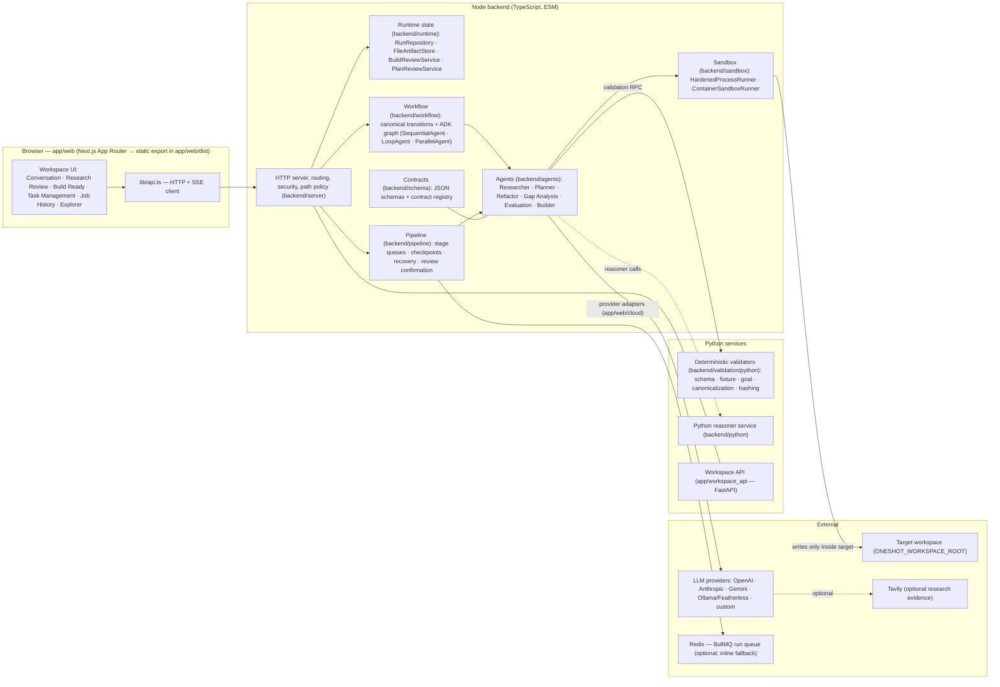
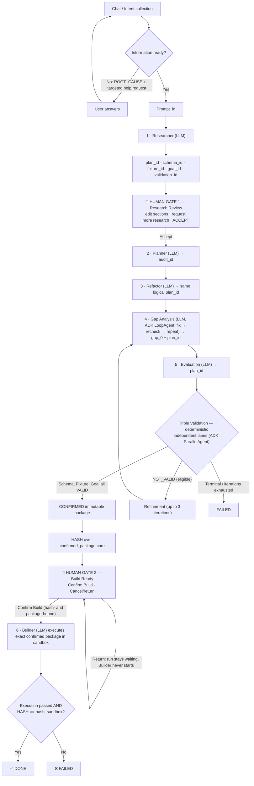
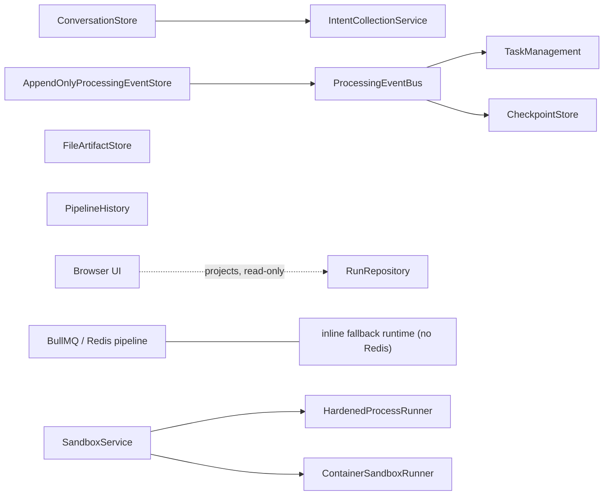
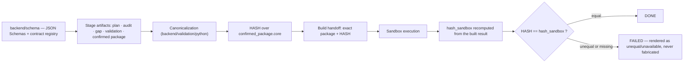
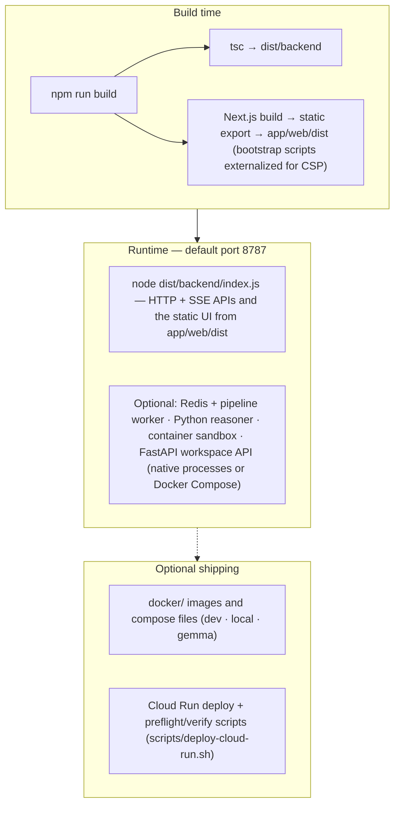

# OneShot Architecture

OneShot is a local-first, human-gated autonomous build pipeline. This document
maps the running system. For the authoritative product behavior, read the
[web app source of truth v3](ONESHOT_WEB_APP_SOURCE_OF_TRUTH_v3.md); for stage
order and artifact ownership, read the [canonical workflow](CANONICAL_WORKFLOW.md);
the ASCII [workflow tree](WORKFLOW_TREE) mirrors the same flow.

All diagrams are Mermaid and render directly on GitHub.

## 1. System view

Key boundaries:

- The browser consumes and projects real backend records, IDs, events, and
  results. It is never a second workflow store, and missing evidence renders
  as unavailable — never as success.
- Provider credentials stay server-side. The browser submits keys once
  (write-only); secrets are stored outside the repository and never returned
  to the client.
- Sandbox admission checks, workspace path policy, and authentication are
  enforced server-side before any target-workspace access.

## 2. Canonical workflow

Six LLM stages, two mandatory human gates, three deterministic validators,
and one hash-bound build handoff.

Deterministic guarantees, enforced in code (not by prompt):

- Planner cannot start before Research Review is explicitly accepted, and
  Builder cannot start before Build Ready is explicitly confirmed
  (`wait-build` + `BuildReviewService` rejects stale hash, changed package,
  duplicate approval, and approval after terminal state).
- The confirmation hash covers the canonical comparable representation of
  `confirmed_package.core`; Builder receives that exact package plus hash,
  and post-build verification is a direct equality check, `HASH ==
  hash_sandbox`, computed by the same canonicalization and hashing code.

## 3. Runtime ownership

The backend runtime is authoritative; the browser projects it
([source of truth §4](ONESHOT_WEB_APP_SOURCE_OF_TRUTH_v3.md)).

- `JobId` is a display alias for the existing `run_id`; there is exactly one
  run identity per run, never a second run-level job identity.
- Events are append-only; checkpoints and the recovery test scripts
  (`test:pipeline:recovery`, `test:pipeline:checkpoint-recovery`,
  `test:pipeline:refinement-recovery`) cover restart and refinement
  recovery behavior.

## 4. Contracts, validation, and hashing

- Triple Validation is three independent proofs — Schema, Fixture, Goal —
  each returning `VALID | NOT_VALID`; `CONFIRMED` exists only when all
  three are `VALID`.
- Result vocabulary is fixed by contract: workflow operations return
  `PASSED | ROOT_CAUSE`; validation operations return `VALID | NOT_VALID`.
- Refinement after a `NOT_VALID` result is bounded (up to 3 iterations)
  before the run terminates as `FAILED`.

## 5. Deployment view

The production frontend path is Next.js App Router → static export →
`app/web/dist/`, served by the Node backend under the existing Content
Security Policy. The legacy reference console (`app/web/src/`) is retained
for tests and reference; it is not the production entrypoint.

## 6. Where to read next

| Topic | Document |
| --- | --- |
| Product behavior authority | [ONESHOT_WEB_APP_SOURCE_OF_TRUTH_v3.md](ONESHOT_WEB_APP_SOURCE_OF_TRUTH_v3.md) |
| Stage order, ownership, human gates | [CANONICAL_WORKFLOW.md](CANONICAL_WORKFLOW.md) |
| ASCII workflow tree | [WORKFLOW_TREE](WORKFLOW_TREE) |
| Requirement-to-implementation status | [WEB_APP_REQUIREMENTS_RECONCILIATION.md](WEB_APP_REQUIREMENTS_RECONCILIATION.md) |
| Latest verification evidence | [APP_REVIEW.md](APP_REVIEW.md) |
| Submission package · demo video kit | [SUBMISSION.md](SUBMISSION.md) · [DEMO_VIDEO_SCRIPT.md](DEMO_VIDEO_SCRIPT.md) |

