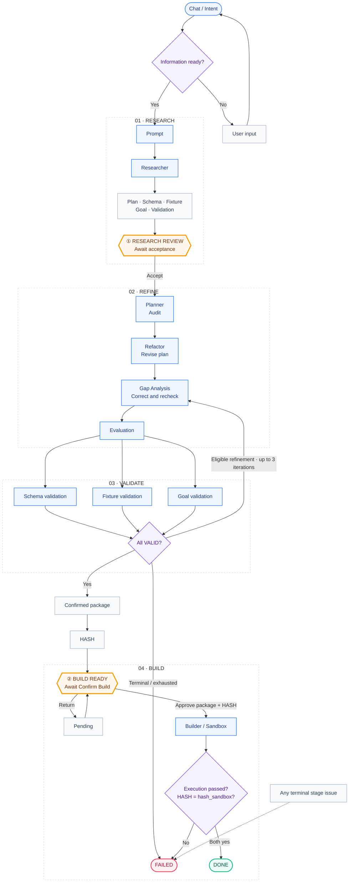

# OneShot Workflow

[Installation](../README.md) · [Text graph](WORKFLOW_TREE) · [Canonical workflow](CANONICAL_WORKFLOW.md)

```mermaid
flowchart TD
    intent([Chat / Intent]) --> ready{Information ready?}
    ready -->|No| input[User input]
    input --> intent
    ready -->|Yes| prompt[Prompt]

    subgraph research [01 · RESEARCH]
        prompt --> researcher[Researcher]
        researcher --> artifacts["Plan · Schema · Fixture<br/>Goal · Validation"]
        artifacts --> review{{"① RESEARCH REVIEW<br/>Await acceptance"}}
    end

    subgraph refine [02 · REFINE]
        planner["Planner<br/>Audit"] --> refactor["Refactor<br/>Revise plan"]
        refactor --> gap["Gap Analysis<br/>Correct and recheck"]
        gap --> evaluation[Evaluation]
    end
    review -->|Accept| planner

    subgraph prove [03 · VALIDATE]
        schema[Schema validation]
        fixture[Fixture validation]
        goal[Goal validation]
        schema --> valid{All VALID?}
        fixture --> valid
        goal --> valid
    end
    evaluation --> schema
    evaluation --> fixture
    evaluation --> goal
    valid -->|Eligible refinement · up to 3 iterations| gap
    valid -->|Terminal / exhausted| failed([FAILED])
    valid -->|Yes| confirmed[Confirmed package]
    confirmed --> hash[HASH]

    subgraph execute [04 · BUILD]
        buildReview{{"② BUILD READY<br/>Await Confirm Build"}}
        buildReview -->|Return| waiting[Pending]
        waiting --> buildReview
        buildReview -->|Approve package + HASH| builder[Builder / Sandbox]
        builder --> proof{"Execution passed?<br/>HASH = hash_sandbox?"}
        proof -->|Both yes| done([DONE])
        proof -->|No| failed
    end
    hash --> buildReview
    terminal[Any terminal stage issue] -.-> failed

    classDef stage fill:#eff6ff,stroke:#3b82f6,color:#1e3a8a,stroke-width:1.5px
    classDef gate fill:#fff7ed,stroke:#f59e0b,color:#78350f,stroke-width:3px
    classDef decision fill:#f5f3ff,stroke:#8b5cf6,color:#4c1d95,stroke-width:1.5px
    classDef artifact fill:#f8fafc,stroke:#94a3b8,color:#334155
    classDef success fill:#ecfdf5,stroke:#10b981,color:#065f46,stroke-width:2px
    classDef failure fill:#fff1f2,stroke:#f43f5e,color:#9f1239,stroke-width:2px

    class intent,prompt,researcher,planner,refactor,gap,evaluation,schema,fixture,goal,builder stage
    class review,buildReview gate
    class ready,valid,proof decision
    class input,artifacts,confirmed,hash,waiting,terminal artifact
    class done success
    class failed failure

    style research fill:transparent,stroke:#cbd5e1,stroke-dasharray:4 4
    style refine fill:transparent,stroke:#cbd5e1,stroke-dasharray:4 4
    style prove fill:transparent,stroke:#cbd5e1,stroke-dasharray:4 4
    style execute fill:transparent,stroke:#cbd5e1,stroke-dasharray:4 4
```
